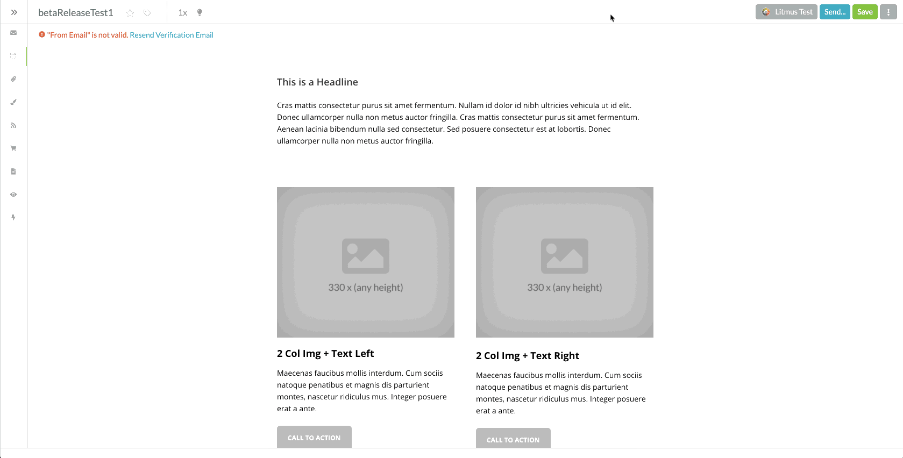

# SHSP-Make-Spacers-Editable
Turns sh-spacer elements in SharpSpring emails into modified buttons. This allows the spacers to be moved, copied and deleted.

<h3>The problem:</h3>

Spacer elements in SharpSpring are not editable. Customers often call in asking how to remove extra spacing in their emails.

<h3>How to use:</h3>
<ol>
  <li>Right click on the page and click "inspect" to open your browser's dev tools.</li>
  <li>Click on the "console" tab.</li>
  <li>Make sure your scope is set to "top".</li>
  <li>Paste the code into the console and hit enter.</li>
  <li>The email should automatically save.</li>
  <li>Receive praise.</li>
</ol>

